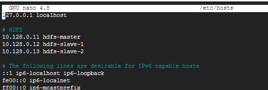
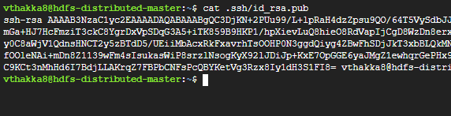
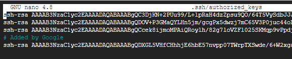
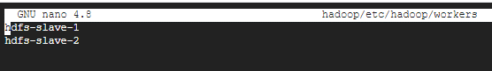

# HDFS in Fully Distributed mode

This document is to show how to setup a fully-distributed HDFS system from scratch. 

---

## Definitions
For this document, the following 3 servers are used.
+	HDFS Master server: &emsp; 10.128.0.11 &emsp; hdfs-master
+	HDFS Slave server 1: &emsp; 10.128.0.12	&emsp; hdfs-slave-1
+	HDFS Slave server 2: &emsp; 10.128.0.13 &emsp; hdfs-slave-2

---

## Setup
The following steps need to be performed on all servers in the HDFS cluster.

### Installing Libraries and downloading HDFS
1.	`sudo apt-get install -y openjdk-8-jdk openssh-server openssh-client`
2.	`wget https://dlcdn.apache.org/hadoop/common/hadoop-3.3.1/hadoop-3.3.1.tar.gz`
3.	`tar -xzf hadoop-3.3.1.tar.gz`

### Configuring your hosts file
The file /etc/hosts needs to be configured for machines in the cluster to be able to locate the other machines without using IP all the time. The master server needs to be able to ssh to itself and the slave servers and the slave servers need to ssh to themselves and the master server.
1.	`nano /etc/hosts`
2.	Update your file as per the requirement 
    
    

### Passwordless connections to hosts
For HDFS to work properly, we cannot have it asking for password every time one device will ssh to another. This requires us to set up authorized users on each of the machine.
1.	This command generated an ssh key that can be used to access the machine without any password authentication: `ssh-keygen -t rsa -f ~/.ssh/id_rsa`
2.	Next, copy the content you get from the command: 1`cat .ssh/id_rsa.pub`

    

3.	You need to add this key to the list of authorized keys on every server, you can do this by opening the file using: `nano .ssh/authorized_keys` and then pasting the content you found in step 2. In the end, your authorized keys file should looks like the image below

    

4.	You still need to add the servers to the known hosts. To do this you need to run: `ssh-keyscan -H <domain name as in hosts file>`, i.e. `ssh-keyscan -H hdfs-slave-1 >> ~/.ssh/known_hosts`. This needs to be done for all the servers on all the servers, a good idea would be to automate this process using a simple shell script that runs this command over and over for all hosts.
5.	Try to ssh using only `ssh hdfs-slave-1` or `ssh hdfs-master`. It should work without any hiccups. 

### Configuring Hadoop files
1.	The {$HADOOP_HOME}/etc/hadoop/hadoop-env.sh file
Locate the JAVA_HOME line and add your java path to it. It most probably looks something like this: `export JAVA_HOME=/usr/lib/jvm/java-1.8.0-openjdk-amd64`
2.	The {$HADOOP_HOME}/etc/hadoop/workers file
Update the file to reflect your slave nodes as shown in the figure

    

3.	The ${HADOOP_HOME}/etc/hadoop/core-site.xml file. Update the configuration as given below:
    ```
    <configuration>
        <property>
            <name>fs.defaultFS</name>
            <value>hdfs://hdfs-master:9000</value>
        </property>
    </configuration>
    ```
4. The ${HADOOP_HOME}/etc/hadoop/hdfs-site.xml file. Update the configuration as given below:
    ```
    <configuration>
        <property>
            <name>dfs.replication</name>
            <value>1</value>
        </property>
        <property>
            <name>dfs.namenode.name.dir</name>
            <value>/home/<username>/hadoopdata/namenode</value>
        </property>
        <property>
            <name>dfs.datanode.data.dir</name>
            <value>/home/<username>/hadoopdata/datanode</value>
        </property>
    </configuration>
    ```

### Wrapping up
The final few steps to having a completely set up HDFS system. You only need to setup the environment variables, format the namenode and you are set to use the HDFS system.
1.	Setup the following Environment variables in your .bashrc file for easier access to the commands everytime you use your machine.
    ```
    export HADOOP_HOME=/home/<username>/hadoop
    export JAVA_HOME=/usr/lib/jvm/java-1.8.0-openjdk-amd64
    export PATH=$PATH:$HADOOP_HOME/bin
    ```

    
    
2. Run the `source ~/.bashrc` command once to run the bashrc file and have all your env variables now usable.
3.	You can now format your namenodes using the command: hdfs namenode -format. 
_Note: This step is to be done on the master server alone._

---

## Usage

Your HDFS setup is now complete and the above steps need not be repeated. Now you can use the master node The following set of commands are useful to start and stop the hdfs setup.
1.	To start the hdfs setup: `$(HADOOP_HOME)/sbin/start-dfs.sh` 
2.	To stop the hdfs setup: `$(HADOOP_HOME)/sbin/stop-dfs.sh`
3.	To check status of hdfs: `hdfs dfsadmin report`

     

You can check the files on your setup by using other hdfs commands like:
```
$	hdfs dfs -ls /
$	hdfs dfs -mkdir /test
$	hdfs dfs -touch /test/file.txt
$	hdfs dfs -rm -r /test
```

And to access the data from servers outside your hdfs nodes, you can use the uri: hdfs://hdfs-master:9000
```
$	hdfs dfs -ls hdfs://hdfs-master:9000/
$	hdfs dfs -mkdir hdfs://hdfs-master:9000/test
$	hdfs dfs -touch hdfs://hdfs-master:9000/test/file.txt
$	hdfs dfs -rm -r hdfs://hdfs-master:9000/test
```


