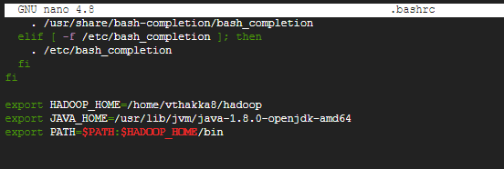
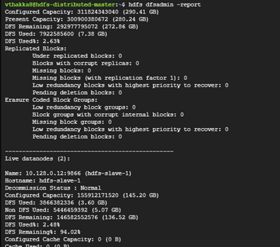

# HDFS in Pseudo Distributed mode

This document is to show how to setup a pseudo-distributed HDFS system from scratch. 

---

## Table of Contents

+ [..](./../)

----

## Definitions
For this document, we will assume the following server is being used.
+	hdfs-server: &emsp; 10.128.0.11

---

## Setup
The following steps need to be performed to setup HDFS in pseudo-distributed mdoe.

### Installing Libraries and downloading HDFS
1.	`sudo apt-get install -y openjdk-8-jdk openssh-server`
2.	`wget https://dlcdn.apache.org/hadoop/common/hadoop-3.3.1/hadoop-3.3.1.tar.gz`
3.	`tar -xzf hadoop-3.3.1.tar.gz`


### Passwordless connections to hosts
For HDFS to work properly, we cannot have it asking for password every time one device will ssh to another. This requires us to set up authorized users on each of the machine.
1.	This command generated an ssh key that can be used to access the machine without any password authentication: `ssh-keygen -t rsa -P '' -f ~/.ssh/id_rsa`
2.	Next, copy your key to the authorized hosts list: `cat ~/.ssh/id_rsa.pub >> ~/.ssh/authorized_keys`
3.	Update permission of the file: `chmod 0600 ~/.ssh/authorized_keys`
4.  Try to `ssh localhost`, enter yes and ssh to localhost is now set 

### Configuring Hadoop files
1.	The {$HADOOP_HOME}/etc/hadoop/hadoop-env.sh file
Locate the JAVA_HOME line and add your java path to it. It most probably looks something like this: `export JAVA_HOME=/usr/lib/jvm/java-1.8.0-openjdk-amd64`

2.	The ${HADOOP_HOME}/etc/hadoop/core-site.xml file. Update the configuration as given below:
    ```
    <configuration>
        <property>
            <name>fs.defaultFS</name>
            <value>hdfs://hdfs-server:9000</value>
        </property>
    </configuration>
    ```
3. The ${HADOOP_HOME}/etc/hadoop/hdfs-site.xml file. Update the configuration as given below:
    ```
    <configuration>
        <property>
            <name>dfs.replication</name>
            <value>1</value>
        </property>
        <property>
            <name>dfs.namenode.name.dir</name>
            <value>/home/<username>/hadoopdata/namenode</value>
        </property>
        <property>
            <name>dfs.datanode.data.dir</name>
            <value>/home/<username>/hadoopdata/datanode</value>
        </property>
    </configuration>
    ```

### Wrapping up
The final few steps to having a completely set up HDFS system. You only need to setup the environment variables, format the namenode and you are set to use the HDFS system.
1.	Setup the following Environment variables in your .bashrc file for easier access to the commands everytime you use your machine.
    ```
    export HADOOP_HOME=/home/<username>/hadoop
    export JAVA_HOME=/usr/lib/jvm/java-1.8.0-openjdk-amd64
    export PATH=$PATH:$HADOOP_HOME/bin
    ```

    

2. Run the `source ~/.bashrc` command once to run the bashrc file and have all your env variables now usable.
3.	You can now format your namenodes using the command: `hdfs namenode -format`.

---

## Usage

Your HDFS setup is now complete and the above steps need not be repeated. Now you can use the master node The following set of commands are useful to start and stop the hdfs setup.
1.	To start the hdfs setup: `$(HADOOP_HOME)/sbin/start-dfs.sh` 
2.	To stop the hdfs setup: `$(HADOOP_HOME)/sbin/stop-dfs.sh`
3.	To check status of hdfs: `hdfs dfsadmin report`

     

You can check the files on your setup by using other hdfs commands like:
```
$	hdfs dfs -ls /
$	hdfs dfs -mkdir /test
$	hdfs dfs -touch /test/file.txt
$	hdfs dfs -rm -r /test
```

And to access the data from servers outside your hdfs nodes, you can use the uri: hdfs://\<server-name>:9000 or the ip address of the server hdfs://\<hdfs-ip-address>:9000/
```
$	hdfs dfs -ls hdfs://hdfs-server:9000/                   (or) hdfs dfs -ls hdfs://10.128.0.11:9000/
$	hdfs dfs -mkdir hdfs://hdfs-server:9000/test            (or) hdfs dfs -mkdir hdfs://10.128.0.11:9000/test
$	hdfs dfs -touch hdfs://hdfs-server:9000/test/file.txt   (or) hdfs dfs -touch hdfs://10.128.0.11:9000/test/file.txt
$	hdfs dfs -rm -r hdfs://hdfs-server:9000/test            (or) hdfs dfs -rm -r hdfs://10.128.0.11:9000/test
```

---

## Contributors
1. Viraj Thakkar ([veedata](github.com/veedata))
