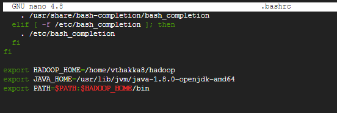

# RocksDB-HDFS: An Installation and Usage guide

This document is to show how to setup RocksDB with the HDFS plugin enabled and how to use it. 

---

## Setup
We will go over the installation for HDFS, RocksDB and then RocksDB with HDFS. An additional section for Environment setup with some ease-of-life options will also be present but is optional. _In case of permission issues with any commands, try using the same command with `sudo` as the prefix._

### HDFS
This document will not be showing how to setup a HDFS environment, it will only go through the downloading and unzipping since some of the files from the HDFS directories are required by the HDFS plugin in RocksDB. \
For Installation and setup of HDFS, please check: [HDFS](./../HDFS/)

1.	`wget https://dlcdn.apache.org/hadoop/common/hadoop-3.3.1/hadoop-3.3.1.tar.gz -O hadoop.tar.gz`
2.  `mkdir hadoop`
3.	`tar -xzf hadoop-3.3.1.tar.gz -C hadoop`
4.  `mv ./hadoop/hadoop-3.3.1/* ./hadoop/`

### RocksDB
This section will deal with the installation of RocksDB with the HDFS plugin

1. `sudo apt-get install -y openjdk-8-jdk libgflags-dev libsnappy-dev zlib1g-dev libbz2-dev liblz4-dev libzstd-dev build-essential`
2. `wget https://github.com/facebook/rocksdb/archive/refs/tags/v7.4.5.tar.gz -O rocksdb.tar.gz` 
3. `tar -xzf rocksdb.tar.gz`

### HDFS Plugin
> Note: If you are going to perform `make install`, you will need admin priviledges. Better to do `sudo su` and run the below commands. 

1. Setup some environment variables:
    ```
    export HADOOP_HOME=/home/<username>/hadoop
    export JAVA_HOME=/usr/lib/jvm/java-1.8.0-openjdk-amd64

    export LD_LIBRARY_PATH=$JAVA_HOME/jre/lib/amd64/server:$JAVA_HOME/jre/lib/amd64:$HADOOP_HOME/lib/native
    export CLASSPATH=`$HADOOP_HOME/bin/hadoop classpath --glob`

    for f in `find $HADOOP_HOME/share/hadoop/hdfs | grep jar`; do export CLASSPATH=$CLASSPATH:$f; done
    for f in `find $HADOOP_HOME/share/hadoop | grep jar`; do export CLASSPATH=$CLASSPATH:$f; done
    for f in `find $HADOOP_HOME/share/hadoop/client | grep jar`; do export CLASSPATH=$CLASSPATH:$f; done
    ```
2.  `cd ./plugin/`
3.  `git clone https://github.com/asu-idi/rocksdb-hdfs hdfs && cd ..` 
4.  `make clean && DEBUG_LEVEL=0 ROCKSDB_PLUGINS="hdfs" make -j$(nproc) install`

### Wrapping up
1.	Setup the following Environment variables in your .bashrc file for easier access to the commands everytime you use your machine.
    ```
    export HADOOP_HOME=/home/<username>/hadoop
    export JAVA_HOME=/usr/lib/jvm/java-1.8.0-openjdk-amd64
    export PATH=$PATH:$HADOOP_HOME/bin
    ```

    

2. Run the `source ~/.bashrc` command once to run the bashrc file and have all your env variables now usable.

---

## Usage


---

## Contributors
1. Viraj Thakkar ([veedata](github.com/veedata))
