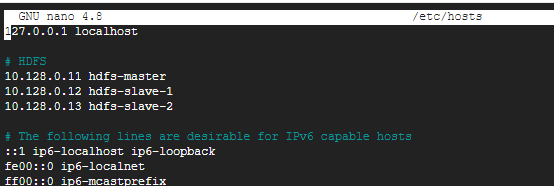

# Article title

<!-- A single line about what this document is for -->
<!-- Think of this to be the entire gist of the document -->
This document is to show how to setup RocksDB with the HDFS plugin enabled and how to use it. 

---

## Table of Contents

<!-- Refers to the repository wide ToC. For Document ToC - github has built-in features.  -->
<!-- In case you feel your document needs an internal ToC, you are doing something wrong -->
<!-- Make sure to break the documents down into multiple easy to follow parts --> -->
+ [parent (rocksdb)](./../RocksDB/)

----

## Definitions

<!-- Some non-trivial terms or definitions unique to asu-idi that are going to be used in the document -->
<!-- Do not populate it with definitions of terms like HDFS, DBs or SSDs. You can link web resources to those in the Pre-requisites section -->
For this document, the following is how we reference servers.
+	HDFS Master server: &emsp; 10.128.0.11 &emsp; hdfs-master
+   HDFS Slave-1 server: &emsp; 10.218.0.12 &emsp; hdfs-slave-1

---

## Pre-requisites

<!-- Only for things that are not covered in the document -->
<!-- Make sure that these things are relevant pre-requisites to understanding/applying the document -->
<!-- This section is to give the reader a stronger understanding of underlying technologies -->
A core part that is not going to be covered is HDFS installation. You need to have HDFS installed in order to have RocksDB work with HDFS
+ [Installing HDFS](./HDFS/HDFS%20Full-Distributed%20Setup.md)

---

## Setup

<!-- How your particular system is to be set up. Go through the steps -->
<!-- Sub sections are highly encouraged if the installation is particularly long -->
<!-- Have sub-sections that act like breakpoints. So, if there is a mess-up, only commands from the last breakpoint have to be repeated -->
<!-- Images are helpful, specially for verification but not a necessity yet since they do take up a lot more time -->

The following steps need to be performed on all servers in the HDFS cluster.

### Installing Libraries and downloading HDFS
1.	`sudo apt-get install -y openjdk-8-jdk openssh-server openssh-client`
2.	`wget https://dlcdn.apache.org/hadoop/common/hadoop-3.3.1/hadoop-3.3.1.tar.gz`
3.	`tar -xzf hadoop-3.3.1.tar.gz`

### Configuring your hosts file
The file /etc/hosts needs to be configured for machines in the cluster to be able to locate the other machines without using IP all the time. The master server needs to be able to ssh to itself and the slave servers and the slave servers need to ssh to themselves and the master server.
1.	`nano /etc/hosts`
2.	Update your file as per the requirement 
    
    

---

## Usage

<!-- How to actually use it, or how to run some basic tests on the system once the installation is completed -->
<!-- This section is highly recommended as it allows the reader to get a quick peek into the application -->

Your HDFS setup is now complete and the above steps need not be repeated. Now you can use the master node The following set of commands are useful to start and stop the hdfs setup.
1.	To start the hdfs setup: `$(HADOOP_HOME)/sbin/start-dfs.sh` 
2.	To stop the hdfs setup: `$(HADOOP_HOME)/sbin/stop-dfs.sh`
3.	To check status of hdfs: `hdfs dfsadmin report`

     

---

## Further Reading

<!-- What's next, some future work you wanted to read into in the given topic and couldn't -->
<!--  -->
<!-- or just something that is an interesting read or motivational after the day of work -->
<!-- You can have your fun with this section, even link [YouTube videos](https://www.youtube.com/watch?v=dQw4w9WgXcQ) -->

Some other cool concepts to explore!!
1. Kubernetes
2. Connecting from one server to another on c++ using hostnames

Relax a bit, its a good thing
1. This song on [youtube](https://www.youtube.com/watch?v=tT1vDp04rJU)

---

## Contributors

<!-- Who all have contributed to writing that particular article -->
<!-- In case of multiple authors, in order of contribution. Mention at least 1 mod of getting in touch (github/mail/etc) -->
1. Viraj Thakkar [[github.com/veedata](https://github.com/veedata)] [[viraj.online@asu.edu](mailto:viraj.online@asu.edu)]
